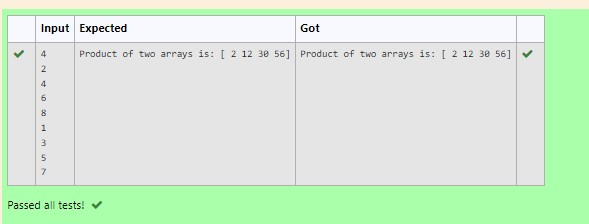

# Multiplying-two-matrix

## AIM:
to write a program multiplying-two-matrix using python programming.
## ALGORITHM:

### Step 1:
import Numpy as np
### Step 2:
get input from the user.
### Step 3:
create empty lists 11 and 12.
### Step 4:
use for loop to append the values into the list created.
### Step 5:
print the product of two arrays.
## PROGRAM: 
import numpy as np
l1,l2=[],[]
n=int(input())
for i in range(n):
    l1.append(int(input()))
for i in range(n):
    l2.append(int(input()))
array_1=np.array(l1)
array_2=np.array(l2)
product=array_1*array_2
print("Product of two arrays is:",product)
## OUTPUT:

## RESULT:
thus the program is written to perform multiplying-two-matrix using python programming.
